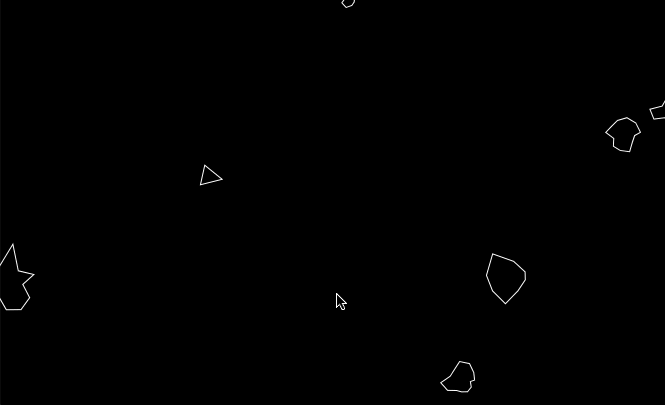

# Asteroids

Follow along with [The Coding Train](https://www.youtube.com/channel/UCvjgXvBlbQiydffZU7m1_aw) to implement basic asteroids game with [p5.js](https://p5js.org/)

Definitely an MVP: simultaneous control input not functional, lacking game features, ect..

The code is pretty rough and can use some refactoring: rename variables, use better js OO practices, ect..

[p5.js](https://p5js.org/) is cool!

Example:

## Thanks

[The Coding Train!](https://www.youtube.com/watch?v=hacZU523FyM)
